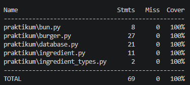

# Stellar Burgers: автоматизация юнит-тестирования

## Описание проекта

В рамках проекта были разработаны юнит-тесты для приложения космической бургерной **Stellar Burgers**.

## Цель проекта

Проверить корректность работы основных компонентов приложения с помощью модульных тестов и обеспечить высокое покрытие кода тестами.

## Реализованные сценарии

Юнит-тестами покрыты основные классы приложения:

| Класс | Проверяемые сценарии |
| --- | --- |
| `Bun` | • Проверка получения названия булочки<br>• Проверка получения цены булочки |
| `Ingredient` | • Проверка получения типа ингредиента<br>• Проверка получения названия ингредиента<br>• Проверка получения цены ингредиента |
| `Burger` | • Установка булочки<br>• Добавление ингредиента<br>• Удаление ингредиента<br>• Перемещение ингредиентов<br>• Расчет полной стоимости бургера<br>• Формирование и рецепт чека |
| `Database` | • Инициализация баз данных булочек и ингредиентов<br>• Получение доступного списка булочек<br>• Получение доступного списка ингредиентов |

Покрытие кода тестами: **100%**  
HTML-отчет формируется в директории `htmlcov/` и доступен в файле `index.html`



## Использованные подходы

В проекте применены:

- **фикстуры Pytest** для создания тестовых объектов и подготовки тестовых данных;
- **Mock-объекты** для изоляции зависимостей класса `Burger`;
- **параметризация тестов** для проверки различных сценариев расчета цены и формирования чека с минимальным дублированием кода;
- **покрытие кода (pytest-cov):** измерение и генерация подробных отчетов о покрытии тестами.

## Технологии

Python 3.14.6, Pytest, pytest-cov, unittest.mock

## Структура проекта

```
.
├── assets/
│   └── coverage.png        # Скриншот отчета о покрытии тестами
├── htmlcov/                # Директория с HTML-отчетом о покрытии кода тестами
├── praktikum/              # Исходный код приложения
│   ├── init.py
│   ├── bun.py              # Класс Булочка
│   ├── burger.py           # Класс Бургер
│   ├── database.py         # Класс База данных
│   ├── ingredient.py       # Класс Ингредиент
│   └── ingredient_types.py # Типы ингредиентов
├── tests/                  # Автоматизированные юнит-тесты
│   ├── init.py
│   ├── test_bun.py         # Тесты для Bun
│   ├── test_burger.py      # Тесты для Burger
│   ├── test_database.py    # Тесты для Database
│   └── test_ingredient.py  # Тесты для Ingredient
├── .gitignore              # Исключения файлов для Git
├── conftest.py             # Фикстуры Pytest
├── data.py                 # Тестовые данные
├── README.md               # Описание проекта
└── requirements.txt        # Зависимости проекта
```

## Результат

Достигнуто:

- **100% покрытие тестами:** полностью проверены методы основных классов сервиса;
- **изоляция компонентов:** применены мок-объекты для исключения зависимости тестов от реальных реализаций смежных классов;
- **корректность бизнес-логики:** подтверждена правильность сборки бургера, расчета суммарной стоимости и формирования итогового чека.

## Запуск автотестов

**Установка зависимостей:**

```bash
pip install -r requirements.txt
```

**Запуск автотестов и создание HTML-отчета о покрытии:** 

```bash
pytest -v --cov=praktikum --cov-report=html
```
